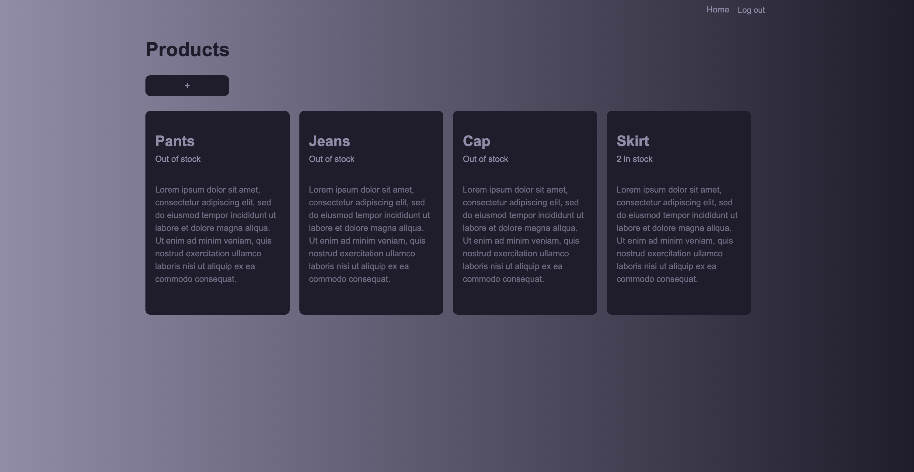

# Product Management System



<br/>
This is a Ruby on Rails application for managing products and their subscribers. The application allows users to create, update, and delete products, as well as manage subscribers who are interested in these products. When a product comes back in stock, subscribers are notified via email.

## Features

- **Product Management**: Create, read, update, and delete products.
- **Subscriber Management**: Add subscribers to products.
- **Stock Notifications**: Notify subscribers when a product comes back in stock.
- **Rich Text Descriptions**: Products can have rich text descriptions.
- **Featured Images**: Attach featured images to products.

## Models

### Product

- `name`: string, required
- `inventory_count`: integer, must be greater than or equal to 0
- `featured_image`: attached image
- `description`: rich text
- Associations:
  - `has_many :subscribers, dependent: :destroy`
- Callbacks:
  - `after_update_commit :notify_subscribers, if: :back_in_stock?`

### Subscriber

- `email`: string, required
- Associations:
  - `belongs_to :product`

## Callbacks

### `after_update_commit :notify_subscribers, if: :back_in_stock?`

This callback is triggered after a product is updated and the changes are committed to the database. It calls the `notify_subscribers` method if the product was previously out of stock and is now back in stock.

### Methods

#### `back_in_stock?`

This method checks if the product was previously out of stock and is now back in stock.

#### `notify_subscribers`

This method sends an email to each subscriber notifying them that the product is back in stock.

## Routes

### Products

- `GET /products`: List all products
- `GET /products/:id`: Show a specific product
- `GET /products/new`: Form to create a new product
- `POST /products`: Create a new product
- `GET /products/:id/edit`: Form to edit a product
- `PATCH/PUT /products/:id`: Update a product
- `DELETE /products/:id`: Delete a product

### Subscribers (Nested under Products)

- `POST /products/:product_id/subscribers`: Create a new subscriber for a specific product

## Setup

1. Clone the repository:

   ```sh
   git clone https://github.com/yourusername/product-management-system.git
   cd product-management-system
   ```

2. Install dependencies:

   ```sh
   bundle install
   ```

3. Set up the database:

   ```sh
   rails db:create
   rails db:migrate
   ```

4. Start the Rails server:

   ```sh
   rails server
   ```

5. Visit http://localhost:3000 in your browser to see the application.
